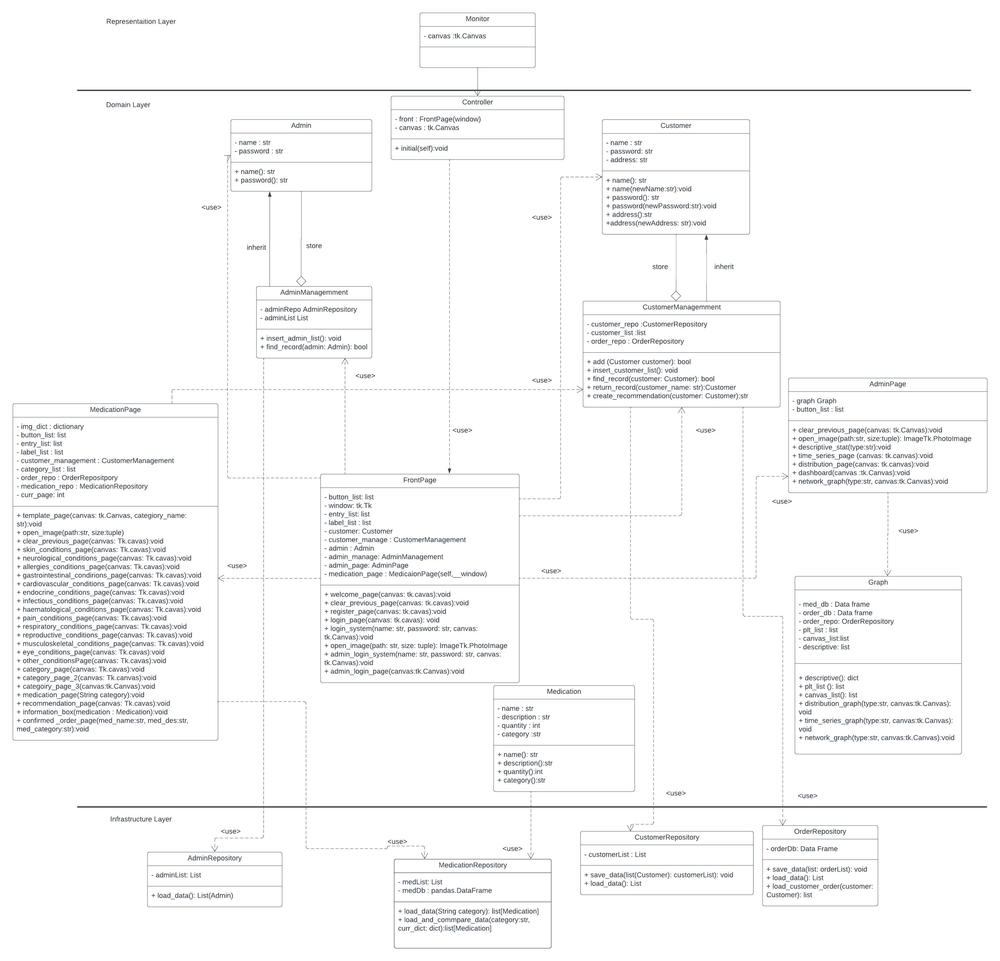

# Pharmalyst

## Description
Pharmalyst is a medication store using python tkinter to build GUI.

The Project uses medication dataset to provide an information about the medication such as medication name, description of the medication, category of that medication and quantity. The system can load and generate based on specific customer purchased history.

Pharmalyst are also include the authentication system, allowing an admin to see the current statistics of the store, normal customer can browse through all of the medication category that they want to.

To start the program you will have to install all of the necessary dependencies then run the file named "Monitor.py"

## Data Sources
All of the medication dataset are from [Kaggle](https://www.kaggle.com/  "Kaggle")
- [Medication dataset](https://www.kaggle.com/datasets/saratchendra/medicine-recommendation "Medication dataset") This dataset provided name and description of the medication that I used in this project.

## Dependencies
Here's are the list of necessary dependencies that I used in the project.
- tkinter
- Pillow
- networkx
- numpy
- pandas
- matplotlib

You can install these dependencies by this command.

`pip install -r requirements.txt
`
## Design
This is sequence diagram will show the sequence of events that will happened if customer loging in to the store.

This is the class diagram which will show the relationship between all of the classes.

## Design Patterns Used
In this project I used facade design pattern as a way to simplify the interface between "Monitor" class and the rest of the class in the lower layer. Facade act like a medium and lower interaction between representation layered and domain layer. This helps reduce the complexity of the code and make it easier to maintain.

## Graph Algorithm Used
My project is to build a medication store, the features that use graph problems to solve would be the recommendation engine. I want to create recommendations based on the purchase history of that specific customer. 

The Idea is to find shortest path from given vertex to all other vertices and then counting the number of vertices that are reachable, The key idea is that if a medication category is more popular, then more medications in that category will be ordered by customers, and hence more nodes will be reachable from the node representing that category.

